# 실시간 게임 서버

시연 영상 : https://youtu.be/UtUiSn3o3l4  
주요 코드 설명 : https://www.notion.so/MMO-26a1e89d067180c493f1c9343960055f?source=copy_link  

### 주요 내용
- IOCP 기반 **비동기 네트워크 처리** 및 멀티스레드 서버 구조 설계
- **그리드 기반 위치 동기화**로 실시간 위치 동기화 구현
- Unity 클라이언트와 연동하여 **실제 플레이 환경 테스트**

## 파일
/IocpClient : 더미 클라이언트 코드  
/IocpServer : 서버 컨텐츠 코드 
/ServerLib : 서버 코어 코드 (네트워크) 

### 사용 기술
- **언어**: C++
- **데이터 베이스**: Mysql
- **네트워크 라이브러리**: TCP, IOCP
- **데이터 직렬화**: Protobuf
- **운영 체제**: Windows

---

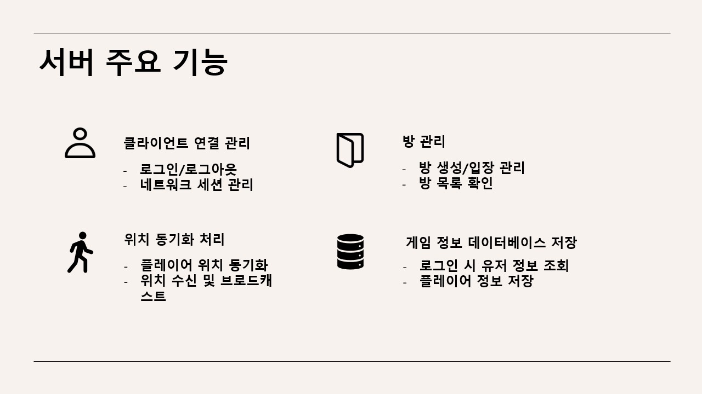
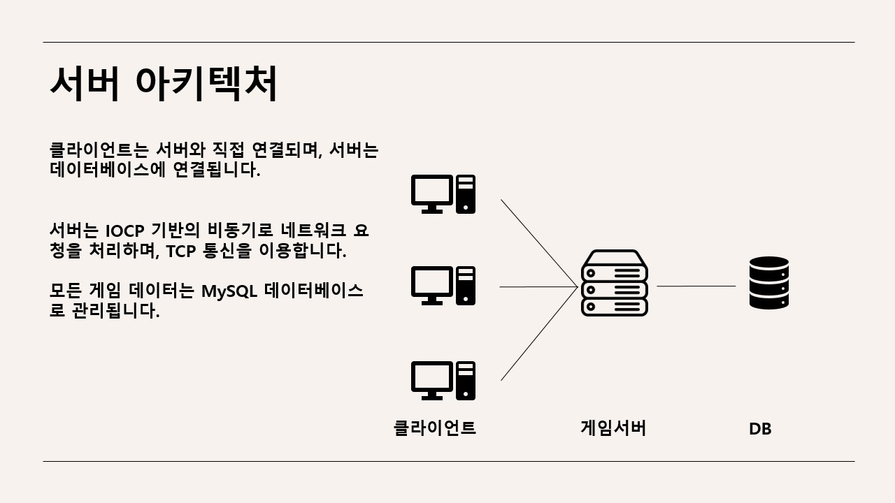
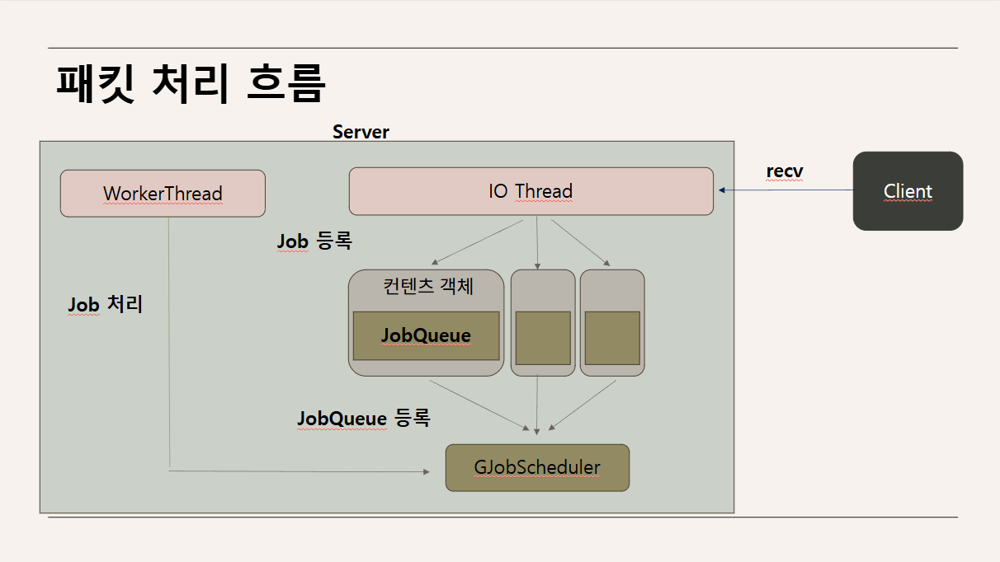
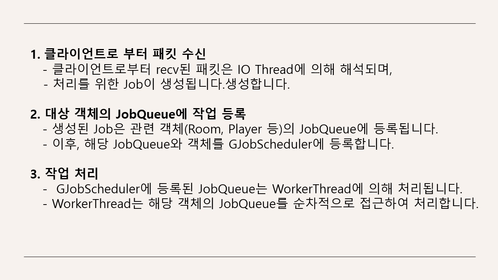
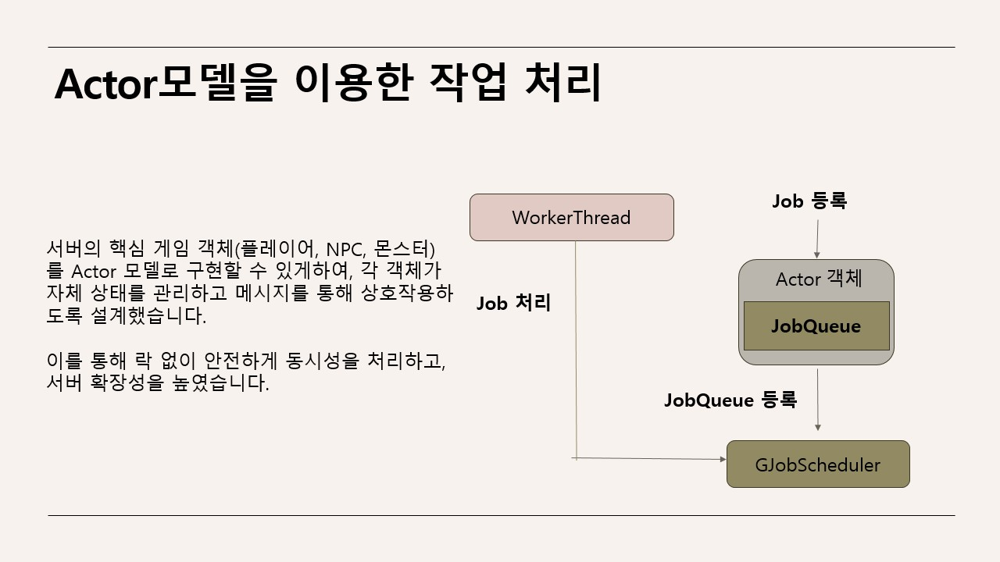
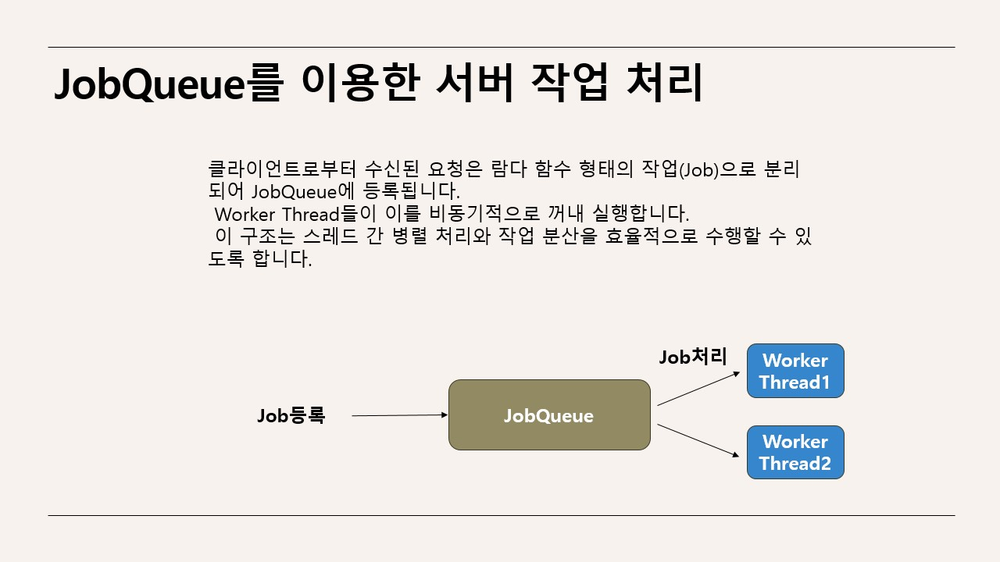
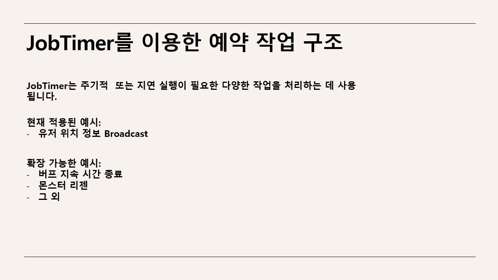

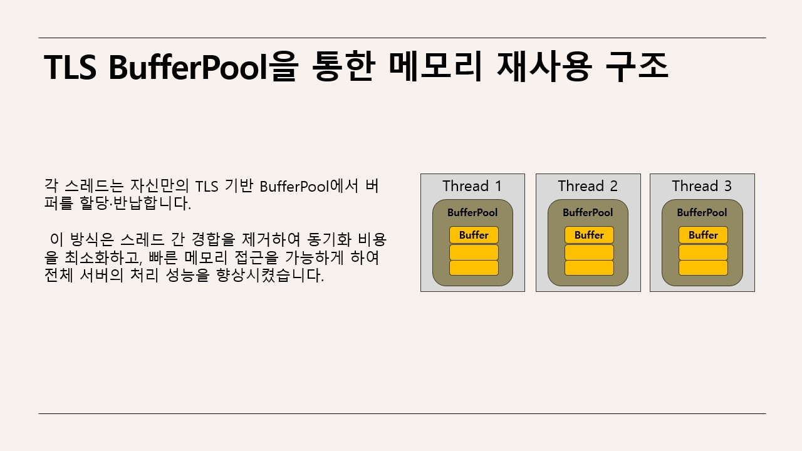
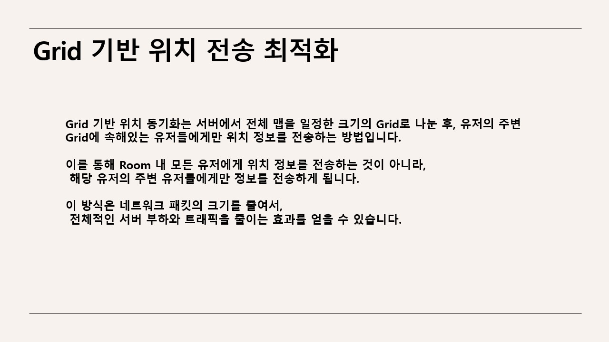
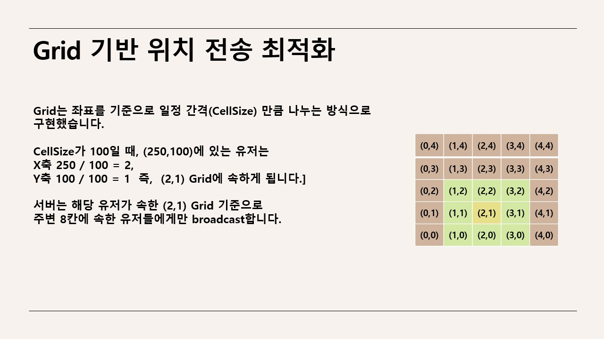
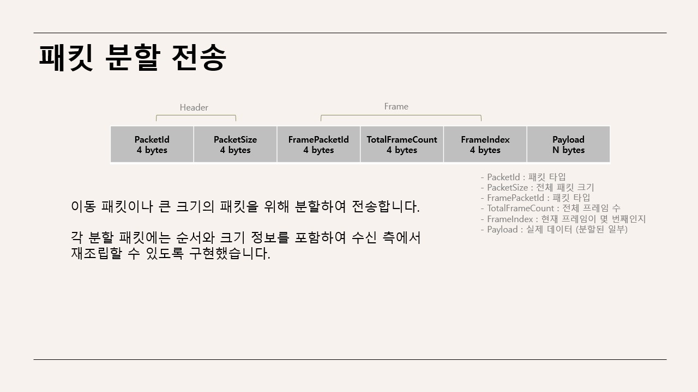

