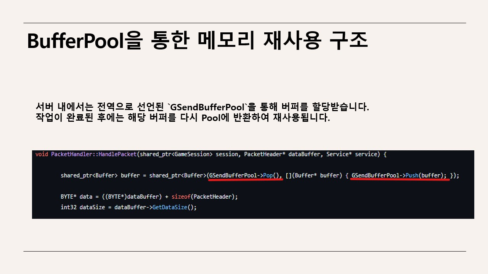
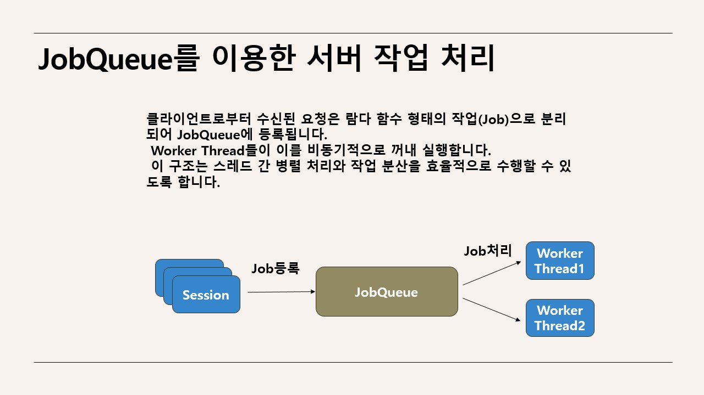

# 실시간 MMO 서버

###주요 내용
- 70명의 유저 위치를 실시간으로 동기화할 수 있는 서버 구조 설계 및 구현
- **IOCP 기반 비동기 네트워크 처리** 및 멀티스레딩 처리
- **Grid 기반 위치 동기화** 구현
- Unity 클라이언트와 연동 테스트

### 사용 기술
- **언어**: C++
- **데이터 베이스**: Mysql
- **네트워크 라이브러리**: TCP, IOCP
- **데이터 직렬화**: Protobuf
- **utf변환**: boost-locale
- **운영 체제**: Windows

---

