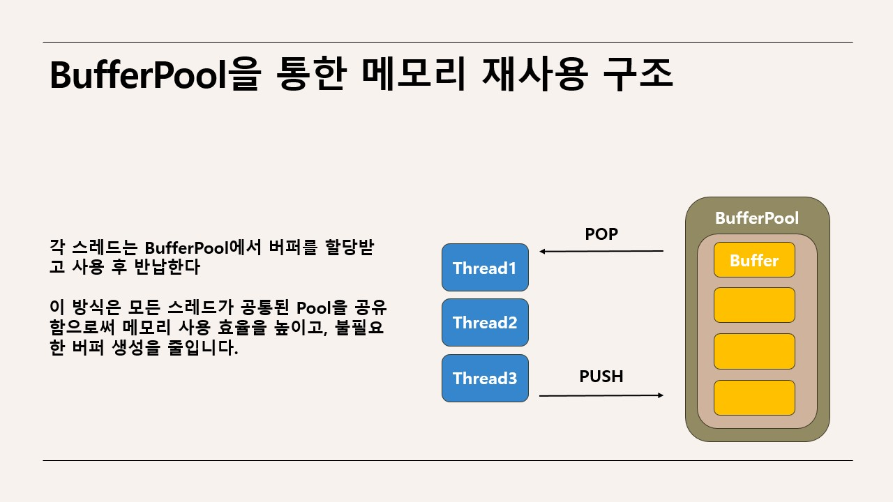
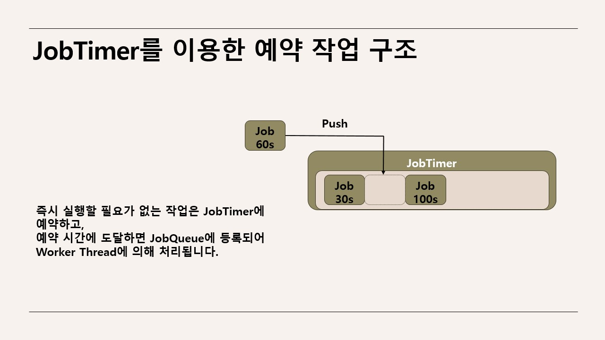

# 실시간 게임 서버

시연 영상 : https://youtu.be/UtUiSn3o3l4  
주요 코드 설명 : https://www.notion.so/MMO-26a1e89d067180c493f1c9343960055f?source=copy_link  

### 주요 내용
- IOCP 기반 **비동기 네트워크 처리** 및 멀티스레드 서버 구조 설계
- **시야 기반 위치 동기화**로 실시간 위치 동기화 구현
- Unity 클라이언트와 연동하여 **실제 플레이 환경 테스트**

### 사용 기술
- **언어**: C++
- **데이터 베이스**: Mysql
- **네트워크 라이브러리**: TCP, IOCP
- **데이터 직렬화**: Protobuf
- **utf변환**: boost-locale
- **운영 체제**: Windows

---

[BufferPool 정의 (Header)](https://github.com/mitjdsusja/IocpServer/blob/main/ServerLib/BufferPool.h) 
[BufferPool 사용 예시 (PacketHandler.cpp: L50–L65)](https://github.com/mitjdsusja/IocpServer/blob/main/IocpServer/PacketHandler.cpp#L50-L65)

[Job 사용 예시 (RoomManager.cpp: L136-145)](https://github.com/mitjdsusja/IocpServer/blob/main/IocpServer/RoomManager.cpp#L136-145)

